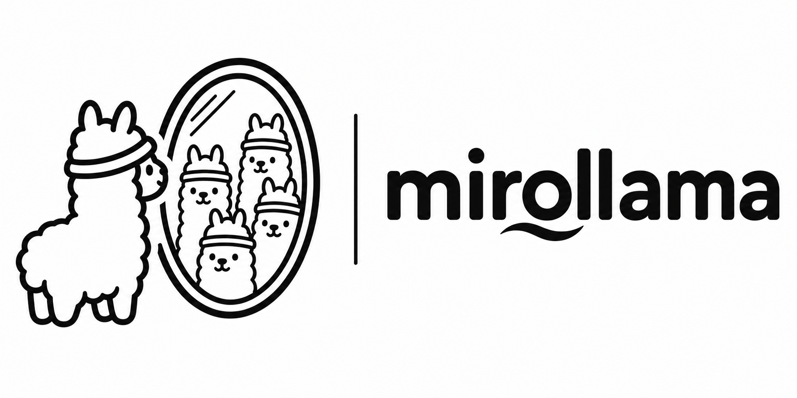

<p align="center">
  
</p>

# mirollama

<p align="center">
  <a href="https://github.com/oswarld/mirollama/stargazers"></a>
  <a href="https://github.com/oswarld/mirollama/watchers"></a>
  <a href="https://github.com/oswarld/mirollama/network/members"></a>
  
</p>

<p align="center">
  <a href="https://x.com/oswarld_oz"></a>
  <a href="https://linkedin.com/in/oswarld"></a>
</p>

<p align="center">
  <a href="README.md">English</a> | <a href="README_ZH.md">中文文档</a> | <a href="README_KO.md">한국어 가이드</a>
</p>

**Local-first scenario simulation with AI agents.**
mirollama is a local-first AI agent simulation workbench that turns your documents into scenario-based simulations.
Upload documents, describe a situation, and let local LLM-powered agents simulate how different stakeholders may react.
> mirollama is not a chatbot.  
> It is a scenario lab.

---

## Try the live demo

Static, PDF-grounded demos that walk through the end-to-end pipeline (graph build → personas → simulation → report) without spinning up Ollama. Each language has its own scenario PDF and its own US / China / Korea persona cohort:

- 🇺🇸 **English** — FAA AI certification plan: [https://mirollama-local-fund-demo.vercel.app/live-demo/en](https://mirollama-local-fund-demo.vercel.app/live-demo/en)
- 🇨🇳 **中文** — 第一次债权人会议公告: [https://mirollama-local-fund-demo.vercel.app/live-demo/zh](https://mirollama-local-fund-demo.vercel.app/live-demo/zh)
- 🇰🇷 **한국어** — 2026 지방소멸대응기금: [https://mirollama-local-fund-demo.vercel.app/live-demo/ko](https://mirollama-local-fund-demo.vercel.app/live-demo/ko)

These demos are intentionally static. To upload your own documents and run real multi-agent simulations, follow the local setup below.

---

## Quickstart (5 minutes, local)

```bash
# 1. Install Ollama and pull the minimum-spec model (~19GB)
ollama pull gemma4:31b
ollama serve   # leaves the OpenAI-compatible API on http://localhost:11434/v1

# 2. Clone and configure
git clone https://github.com/oswarld/mirollama.git
cd mirollama
cp .env.example .env

# 3. Install everything (root, frontend, backend)
npm run setup:all

# 4. Run frontend + backend together
npm run dev
```

Open `http://localhost:3000` for the UI and `http://localhost:5001/health` to confirm the backend.

> mirollama uses **Gemma4 31b as its minimum baseline model**. Smaller models (7B–20B) will run but produce noticeably weaker ontology extraction and persona behavior. Hardware requirements for the minimum baseline are detailed in [System requirements](#system-requirements) below.

---

## Repository layout
- `backend/` — Python (Flask) backend, run via `uv`
- `frontend/` — main web app UI (Vue 3 + Vite)
- `local-fund-demo/` — static Next.js demo console deployed publicly (the live demo above)
- `persona-dashboard/` — supporting UI tooling (optional)

## Demos

### Local fund demo (static)
The `local-fund-demo/` package is a self-contained static demo to showcase the end-to-end “pipeline narrative” (graph build → personas → simulation → report) using a fixed source PDF.

```bash
cd local-fund-demo
npm install
npm run dev
```

Open:
- `http://localhost:3000/` (landing)
- `http://localhost:3000/console` (live console)
- `http://localhost:3000/local_100M.pdf` (source document)

## What is mirollama?
mirollama helps you explore possible reactions, narratives, conflicts, and stakeholder dynamics before they happen.
Instead of asking one AI model for a single answer, mirollama creates multiple AI agents from your documents and lets them interact inside a simulated environment.
You can use mirollama to explore questions like:
- How might customers react to a new product launch?
- How might students, professors, and administrators respond to a new university policy?
- How might different communities react to a controversial announcement?
- How might internal teams interpret a strategic memo?
- How might public opinion evolve around a market, policy, or social issue?
mirollama is designed for people who want to test scenarios, not just generate text.
---
## Core idea
Most AI tools answer a question.
mirollama helps you simulate a situation.
The basic workflow is simple:
```text
Documents + Scenario
        ↓
Ontology generation
        ↓
Agent profile generation
        ↓
Multi-agent simulation
        ↓
Report and insights
```

You provide the context. mirollama builds the simulation environment.

---

## How it works

1. Upload documents  
   Upload PDFs, Markdown files, or plain text documents.

   These documents may include:
   - Policy drafts
   - Market reports
   - Product briefs
   - Research notes
   - Meeting summaries
   - Community posts
   - News articles
   - Internal strategy documents

2. Describe the simulation scenario  
   Tell mirollama what you want to simulate.

   Example:
   - Simulate how students, professors, administrators, and media might react if a university introduces a strict AI usage policy.

3. Generate ontology  
   mirollama analyzes the uploaded documents and extracts important entity types, stakeholder types, and relationships.

   For example:
   - Entity types:
     - Student
     - Professor
     - Administrator
     - Journalist
     - Parent
     - Online community member
   - Relationship types:
     - supports
     - criticizes
     - influences
     - reports_on
     - reacts_to

4. Create agent profiles  
   mirollama turns extracted entities and stakeholder types into AI agent profiles.

   Each agent can have:
   - Role
   - Background
   - Motivation
   - Beliefs
   - Memory
   - Behavioral tendency

5. Run simulation  
   Agents interact in a social-media-like environment inspired by Twitter and Reddit dynamics.

   They may:
   - Create posts
   - Comment
   - Like or dislike
   - Repost
   - Follow
   - React to other agents
   - Shift opinions over time

6. Generate report  
   mirollama summarizes what happened during the simulation.

   The report may include:
   - Key narratives
   - Emerging conflicts
   - Stakeholder reactions
   - Risk signals
   - Possible opportunities
   - Summary insights

---

## Why local-first?
Many scenario simulations involve sensitive information.

You may want to test ideas using:
- Internal documents
- Unreleased strategies
- Research materials
- Client data
- Policy drafts
- Private notes

mirollama is designed to work with local LLMs through Ollama by default.

This means:
- No mandatory cloud LLM API
- Better privacy for sensitive documents
- Local experimentation
- OpenAI-compatible local endpoint support
- Optional integration with external graph/search tools

---

## Recommended models

mirollama is tuned for capable local models. The minimum baseline is **`gemma4:31b`** — anything smaller (7B / 13B / 20B / 26B) runs, but the ontology, persona generation, and multi-agent narratives become visibly thinner.

| Model | When to pick it | Approx. on-disk | Approx. memory at runtime |
|-------|-----------------|-----------------|--------------------------|
| `gemma4:31b` | **Minimum baseline** — start here | ~19 GB (q4_K_M) | ~22–24 GB unified / VRAM |
| `gpt-oss:120b` | High quality, complex multi-stakeholder simulations | ~70 GB (q4) | ~80 GB unified / VRAM |
| `gpt-oss:20b` | Resource-constrained — works but expect weaker reasoning | ~12 GB | ~14–16 GB |

```bash
# Minimum baseline (recommended starting point)
ollama pull gemma4:31b

# Higher quality (needs a workstation/server class GPU)
ollama pull gpt-oss:120b
```

Sub-baseline models (`gemma4:26b`, `gpt-oss:20b`, `llama3:8b`, etc.) are usable for early local testing but are not officially supported for the full simulation pipeline.

---

## System requirements

The minimum baseline below assumes you are running **`gemma4:31b`**. To run `gpt-oss:120b` or other 70B+ models, plan on roughly 4× the memory.

### macOS (Apple Silicon)
| | Minimum (gemma4:31b) | Recommended | Notes |
|---|---|---|---|
| Chip | M1 Max / M2 Pro / M3 Pro | M2 Max / M3 Max / M4 Pro+ | Inference uses Metal; no CUDA needed |
| Unified memory | **24 GB** | 32 GB+ | 16 GB Macs cannot fit a 31B model in memory |
| Storage | 30 GB free | 100 GB free for multi-model setups | |

### Windows / Linux (NVIDIA)
| | Minimum (gemma4:31b) | Recommended | Notes |
|---|---|---|---|
| GPU | RTX 3090 / 4090 / A5000 | RTX 6000 Ada / A6000 / dual-3090 | **24 GB VRAM** is the practical floor for 31B at decent speed |
| System RAM | 32 GB | 64 GB+ | Backend + frontend + Ollama + browser |
| CPU | 6-core modern | 8-core modern | |
| OS | Windows 11 / Ubuntu 22.04+ | same | CUDA toolkit installed |
| Storage | 30 GB free | 100 GB+ free | |

### CPU-only / Intel Mac
Technically possible with 64 GB+ RAM, but `gemma4:31b` will respond at <1 token/sec on most consumer CPUs. Practical only for offline batch experiments.

### Software prerequisites
- Node.js 20+ (18 still works, 20+ recommended)
- Python 3.11+
- [`uv`](https://github.com/astral-sh/uv) (Python package manager — required for the backend)
- [Ollama](https://ollama.com) running locally
- A pulled model (`gemma4:31b` minimum)

---

## Local setup (detailed)

### 1. Install Ollama and pull the baseline model
Install Ollama from [https://ollama.com](https://ollama.com), then:

```bash
# 19 GB download — make sure you have the disk and memory budget above
ollama pull gemma4:31b

# Start the OpenAI-compatible API on http://localhost:11434/v1
ollama serve
```

Verify Ollama is reachable:
```bash
curl http://localhost:11434/v1/models
```

### 2. Clone the repository
```bash
git clone https://github.com/oswarld/mirollama.git
cd mirollama
```

### 3. Configure environment
```bash
cp .env.example .env
```

`.env` for the minimum local baseline:
```dotenv
# Ollama OpenAI-compatible endpoint
LLM_BASE_URL=http://localhost:11434/v1
LLM_MODEL_NAME=gemma4:31b

# LLM_API_KEY is optional for local Ollama. Leave commented unless your
# proxy or self-hosted gateway requires a token.
# LLM_API_KEY=ollama

# Search provider
# none: pure local, no web search
# searxng: self-hosted SearXNG instance
SEARCH_PROVIDER=none
SEARXNG_BASE_URL=
WEB_SEARCH_LANGUAGE=en-US
WEB_SEARCH_LIMIT=10
```

### 4. Install dependencies
```bash
npm run setup:all   # installs root, frontend, and backend (uv sync)
```

If you only need the frontend or backend individually:
```bash
npm run setup           # root + frontend
npm run setup:backend   # backend (uv sync)
```

### 5. Run mirollama
```bash
npm run dev
```

- Frontend: `http://localhost:3000`
- Backend: `http://localhost:5001`
- Health check: `http://localhost:5001/health`

### 6. Verify the loop end-to-end
1. Drop a short PDF or markdown file into the upload area
2. Type a one-sentence scenario (for example: *"Simulate how three city groups might react if this policy passes next month."*)
3. Watch the pipeline run: ontology → personas → simulation → report
4. If the run hangs at "Building Graph" or persona generation, your model is likely too small or out of memory — try `gemma4:31b` if you were on a smaller model, or close other GPU/Metal-using apps

---

## Available scripts
 - `npm run setup`: Install root and frontend dependencies.
 - `npm run setup:backend`: Install backend dependencies with `uv`.
 - `npm run setup:all`: Install all dependencies.
 - `npm run dev`: Run frontend and backend together.
 - `npm run backend`: Run backend only.
 - `npm run frontend`: Run frontend only.
 - `npm run build`: Build frontend for production.

---

## Modes
mirollama supports multiple operating modes.

### Local mode
Local mode is the default mode.

```dotenv
SEARCH_PROVIDER=none
```

In local mode, mirollama uses your uploaded documents and local LLM to generate simulation artifacts.

Use local mode when you want:

* Simple setup
* Local-first experimentation
* No external graph memory
* No cloud dependency
* Private document-based simulation

This is the recommended starting point.

---

### SearXNG mode

```dotenv
SEARCH_PROVIDER=searxng
SEARXNG_BASE_URL=http://localhost:8080
```

Use SearXNG mode when you want to connect mirollama with a self-hosted search engine.

This can help simulations incorporate external search results while still avoiding commercial search APIs.

---

## Example use cases

### 1. Product launch simulation

Upload:

* Product brief
* Customer research
* Pricing document
* Competitor analysis

Scenario:

Simulate how early adopters, enterprise buyers, competitors, and influencers might react to a new AI productivity tool launch.

Possible output:

* Customer excitement and objections
* Pricing sensitivity
* Competitor narrative
* Risk signals
* Go-to-market insights

---

### 2. Policy reaction simulation

Upload:

* Policy draft
* Public survey
* News articles
* Stakeholder statements

Scenario:

Simulate public reaction to a new government AI regulation policy.

Possible output:

* Supporter narratives
* Critic concerns
* Media framing
* Online community reactions
* Political and social risks

---

### 3. University AI policy simulation

Upload:

* AI usage policy
* Student survey
* Faculty meeting notes
* Academic integrity guidelines

Scenario:

Simulate how students, professors, teaching assistants, and administrators might react to a strict AI assignment policy.

Possible output:

* Student fairness concerns
* Faculty disagreement
* Administrative risk management
* Media controversy potential
* Suggested communication strategy

---

### 4. Market narrative simulation

Upload:

* Analyst reports
* Company announcement
* Industry news
* Community discussions

Scenario:

Simulate how investors, analysts, retail traders, and media might react to a major strategic announcement.

Possible output:

* Bullish and bearish narratives
* Misinterpretation risks
* Information gaps
* Narrative shift over time

---

## Project structure

```text
mirollama
├── backend
│   ├── app
│   │   ├── api
│   │   ├── models
│   │   ├── services
│   │   └── utils
│   ├── scripts
│   ├── uploads
│   └── run.py
│
├── frontend
│   ├── src
│   │   ├── views
│   │   ├── router
│   │   ├── components
│   │   └── services
│   └── package.json
│
├── docker-compose.yml
├── package.json
└── README.md
```

---

## Backend overview

The backend is built with Flask.

Core API groups:
```text
/api/graph
/api/simulation
/api/report
```

Main responsibilities:

* File upload
* Text extraction
* Ontology generation
* Graph construction
* Agent profile generation
* Simulation preparation
* Simulation execution
* Report generation

---

## Frontend overview

The frontend is built with Vue 3 and Vite.

Main views include:

* Home
* Process
* Simulation
* Simulation Run
* Report
* Interaction

The frontend is designed as a workflow interface for moving from documents to simulation results.

---

## Docker

A Docker Compose configuration is included.
```bash
docker compose up -d
```

Default ports:
- Frontend: `3000`
- Backend: `5001`

Uploaded files and generated artifacts are mounted to:

./backend/uploads

Note: depending on the current image configuration, Docker may use the upstream MiroFish image. If you are developing mirollama directly, running from source is recommended.

---

## API overview
- Health check: `GET /health`
- Generate ontology: `POST /api/graph/ontology/generate`
- Build graph: `POST /api/graph/build`
- Create simulation: `POST /api/simulation/create`
- Prepare simulation: `POST /api/simulation/prepare`
- Generate report: `POST /api/report`

---

## Recommended first test

If this is your first time running mirollama, try the following setup:
```dotenv
LLM_BASE_URL=http://localhost:11434/v1
LLM_MODEL_NAME=gemma4:31b
SEARCH_PROVIDER=none
WEB_SEARCH_LANGUAGE=en-US
```

Then upload a short Markdown or text file and use a simple scenario such as:

Simulate how different stakeholders might react to this announcement.

For best results, include documents that clearly describe:

* The situation
* The stakeholders
* The conflict or decision
* The expected environment
* The purpose of the simulation
 
---

## Tips for better simulations

### Use specific scenarios
Less effective:
```text
Analyze this document.
```

More effective:
```text
Simulate how customers, competitors, and media might react if this product launches at a higher price than expected.
```

### Upload context-rich documents
Better simulations come from better context. Good documents include:
- Background information
- Stakeholder descriptions
- Conflicting opinions
- Prior events
- Market or social context

### Use stronger models for complex simulations
- Complex documents / nuanced scenarios: `gpt-oss:120b`
- General local testing (minimum baseline): `gemma4:31b`

### Optional persona datasets by country
If you need country-specific persona datasets, download them from Hugging Face and keep them local.

Example:
- Korea: https://huggingface.co/datasets/nvidia/Nemotron-Personas-Korea

Recommended local path:
- `Nemotron-Personas-Korea/`

Important:
- Do not commit `.arrow` files to Git.
- Keep large dataset files in local cache/storage only.

---

## Roadmap

Planned improvements:

* Live demo page
* Better local-only entity extraction
* More example simulation templates
* Improved report visualization
* Better Korean-language simulation examples
* Built-in demo datasets
* More simulation environments
* Cleaner Docker image under the mirollama namespace
* Exportable reports
* Scenario comparison mode

---

## Security note

mirollama is designed for local-first experimentation.

If you expose the backend to the public internet, make sure to configure:

* Authentication
* CORS
* Secret key
* Upload limits
* File validation
* Network restrictions

Do not expose sensitive documents through an unsecured public deployment.

---

## License
MIT

---

## Credits

mirollama is a derivative work based on MiroFish by 666ghj.
